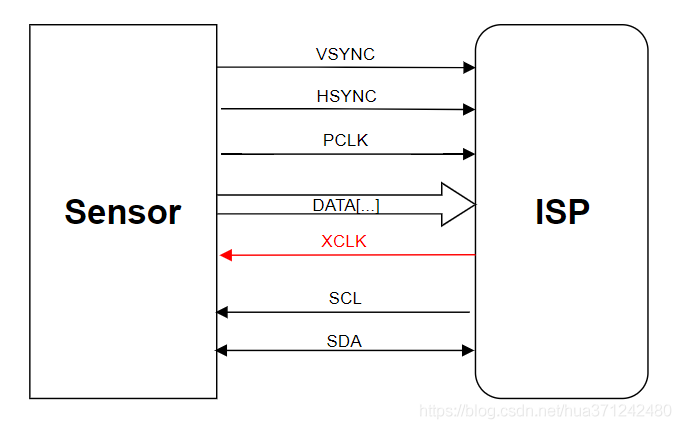

# DRV_DMADVP

[TOC]

## 简介

数字视频接口DMA接收器（DMADVP）是使用外部中断和DMA设备接收摄像头图像数据的组件。本组件适用于任何使用8-bit数字视频接口（DVP，Digital Video Port）的摄像头。

> DVP（Digital Video Port） 是传统的sensor输出接口，采用并行输出方式，d数据位宽有8bit、10bit、12bit、16bit，是CMOS电平信号（重点是非差分信号），PCLK最大速率为96MHz，接口如下图：
>
> 
>
> **PCLK**：pixel clock ,像素时钟，每个时钟对应一个像素数据；
> **HSYNC**：horizonal synchronization，行同步信号
> **VSYNC**：vertical synchronization，帧同步信号；
> **DATA**：像素数据，视频数据，具体位宽要看ISP是否支持；
> **XCLK**：或者MCLK，ISP芯片输出给驱动sensor的时钟；
> **SCL**，**SDA**：IIC用来读写sensor的寄存器，配置sensor。
>
> 以上内容摘自 https://blog.csdn.net/hua371242480/article/details/88629023 。如有侵权请联系我们删除。


## 版本说明

### v0.2.0

by CkovMk @hitsic 2021.04.07

**改动说明**

- 为兼容新版EXTINT所做的必要修改
- 为了兼容C语言，删掉了C++ STL的队列容器（queue），改为使用固定长度的队列。
- 修改、新增了一些LOG输出

**开发计划**

- 暂无

**已知问题**

- 暂无


### v0.1.2

by CkovMk @hitsic 2020.11.09

改进双缓存操作

**改动说明**

- 修改TransferStart逻辑，修复了帧率减半的Bug。
- 完善代码内注释文档。
- 调整默认DMA中断优先级为8。

**开发计划**

- 暂无

**已知问题**

- 暂无


### v0.1-beta.1

by CkovMk @hitsic 2020.10.30

改进双缓存操作

**改动说明**

- 图像接收缓存改为缓存队列。

**开发计划**

- 继续改进双缓存，提供config配置项来控制是否自动进行下一帧传输。

**已知问题**

- 图像接收的帧率只有设定值的一半。


### v0.1-beta.0

by CkovMk @hitsic 2020.10.20

初始版本。

**改动说明**

- 初始版本

**开发计划**

- 暂无

**已知问题**

- 暂无


## API文档

详见头文件内的doxygen风格注释


## 设计文档

### 虚拟设备（DMADVP_Type）

DMADVP组件在设计上模仿了I.MX RTyyyy系列单片机SDK中CSI外设的Transactional API。为了尽可能贴近CSI的使用体验，降低切换单片机的难度，DMADVP被写成了虚拟外设的形式，代码如下：

```c++
struct DMADVP_Type
{
    INTC_Type* vsnc_intc;
    uint32_t vsnc_pin;
    INTC_Type* pclk_intc;
    uint32_t pclk_pin;

    uint32_t dmaDataAddress;
    uint32_t dmaChannel;
    uint32_t dmauxChannel;
    uint32_t dmamuxRequestSrc;
    IRQn_Type dmaIrqn;
    uint32_t dmaIrqPrio;

    uint32_t imgSize;

    port_interrupt_t vsncInterruptCfg;
    port_interrupt_t pclkInterruptCfg;
    
    extint_handle_t extintHandle;
};

#define DMADVP_CNT (1U)

#define DMADVP0_DAT0_GPIO          RTEPIN_DIGITAL_CAM_D_0_GPIO
#define DMADVP0_DAT0_PORT          RTEPIN_DIGITAL_CAM_D_0_PORT
#define DMADVP0_DAT0_PIN           RTEPIN_DIGITAL_CAM_D_0_PIN
#define DMADVP0_DMA_INST           (DMA0)
#define DMADVP0_DMAMUX_INST        (DMAMUX0)
#define DMADVP0_DATA_DMA_ADDR      (((uint32_t)DMADVP0_DAT0_GPIO)+0x10+DMADVP0_DAT0_PIN/8)
extern DMADVP_Type __DMADVP0;
#define DMADVP0 (&__DMADVP0)
```

您可以像使用单片机原生的GPIO外设一样使用本模组。但是请时刻记得，该模块是由GPIO外部中断、DMA触发器（DMAMUX）和DMA设备共同组合成的软件模拟虚拟设备，在配置这些设备的中断优先级时务必仔细处理。


### 传输句柄（dmadvp_handle_t）

同样是为了模仿I.MX RTyyyy系列单片机SDK中CSI外设的Transactional API，DMADVP具有功能类似的传输句柄。

```c++
/*! @brief DMADVP句柄 */
struct dmadvp_handle_t
{
    DMADVP_Type* base;              /*!< DMADVP虚拟设备地址 */
    edma_handle_t dmaHandle;        /*!< DMA传输句柄 */
    edma_transfer_config_t xferCfg; /*!< DMA传输配置 */
    volatile bool transferStarted;  /*!< 传输中标志位，true：正在进行传输 */
    std::queue<uint8_t*> emptyBuffer, fullBuffer;
};
```


## 应用指南

### 初始化

- 获取配置数据`dmadvp_config_t`。您可以手动配置，也可以在使用摄像头配置器配置完成摄像头后，调用摄像头配置器的相关API产生此数据。
- 调用`status_t DMADVP_Init(DMADVP_Type *base, const dmadvp_config_t *config);`函数，初始化DMADVP虚拟设备。
- 调用`void DMADVP_TransferCreateHandle(dmadvp_handle_t *handle, DMADVP_Type *base, edma_callback callback);`函数，初始化传输句柄。


### 基础用法：单缓存

- 为缓存区分配足够的内存

- 调用`status_t DMADVP_TransferSubmitEmptyBuffer(DMADVP_Type *base, dmadvp_handle_t *handle, uint8_t *buffer);`提交空缓存区。

- 调用`status_t DMADVP_TransferStart(DMADVP_Type *base, dmadvp_handle_t *handle);`启动传输。传输完成时DMA中断会自动调用您在初始化时注册的`callback`回调函数。

- 在回调函数中，首先调用`void DMADVP_EdmaCallbackService(dmadvp_handle_t *handle, bool transferDone);`进行基础维护，然后调用`status_t DMADVP_TransferStart(DMADVP_Type *base, dmadvp_handle_t *handle);`停止本次传输。

  随后判断`transferDone`标志：

  - 如果为真，调用`status_t DMADVP_TransferGetFullBuffer(DMADVP_Type *base, dmadvp_handle_t *handle, uint8_t **buffer);` 获取传输完毕的缓存区；
  - 如果为假，说明传输过程出现了错误，进行错误处理。


### 进阶用法：缓存队列

- 开始过程与单缓存基本相同，不同之处在于开始传输之前应至少提交两个空缓存区。

- 在回调函数中，进行基础维护之后：

  不要调用`status_t DMADVP_TransferStart(DMADVP_Type *base, dmadvp_handle_t *handle);`，直接调用`status_t DMADVP_TransferStart(DMADVP_Type *base, dmadvp_handle_t *handle);`再次启动传输。

  - 如果此时空缓存队列不为空，则自动使用其中的缓存区进行下一次传输。
  - 如果此时空缓存队列已空，上述函数将返回`kStatus_DMADVP_NoEmptyBuffer`。

  随后继续按单缓存中的方法获取传输完毕的缓存区。


## 移植指南

（待续）

