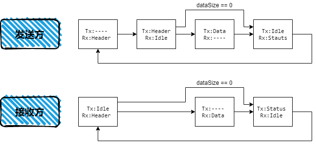

# SYS_RMCALL

[TOC]

## 简介

远程调用组件（RMCALL，Remote Call Module），是利用串行接口或其他传输协议，远程调用其他计算机程序的特定函数的组件。本组件常用于双单片机、多单片机、单片机系统与上位机协同工作时的功能调用和消息传递。RMCALL字节序采用小端序。

（1）  能够通过TTL串口传输

（2）  具有固定的通信帧格式

（3）  具备对称的双向通信能力

（4）  传输内容灵活，能够携带指令和数据

（5）  指令集易于管理和扩展


## 版本说明

### v1.0-beta.0

by CkovMk @hitsic 2021.06.25

**改动说明**

- 修改为C语言
- 可以实现多实例
- 不再使用UARTMGR（已废弃）
- 使用M-LIB提供C语言下的字典容器支持

**开发计划**

- 可选守护进程，增加超时功能，提高鲁棒性
- 增加对超长数据（大于64KB）的支持
- 增加可配置的校验功能

**已知问题**

- 暂无


### v0.1-beta.0

by CkovMk @hitsic 2020.10.07

**改动说明**

- 首个版本。

**开发计划**

- 增加超时功能
- 增加对超长数据（大于64KB）的支持
- 抽象通信接口，支持其他传输方式
- 全双工传输支持

**已知问题**

- 暂无


## API文档

详见`sys_rmcall.h`文件内的注释


## 设计文档

### 概论

RMCALL的核心思想是远程调用函数。


### 基本概念

- **RMCALL实例（rmcall_t）**

	RMCALL实例是指一个完整的RMCALL组件对象，往往与串口等通信接口一一对应。RMCALL具备处理通信中断、发起RMCALL调用、解析并执行收到的RMCALL调用、注册和删除RMCALL句柄的功能。

- **RMCALL服务函数（rmcall_handler_t）**

	RMCALL服务函数是具有“void (void)”签名的C语言函数，是RMCALL句柄能够调用的唯一类型。

- **RMCALL句柄ID（handleId）**

  RMCALL句柄ID是RMCALL实例对外暴露的调用序号，每个序号唯一对应一个RMCALL服务函数。句柄ID的数据类型是uint16_t，取值范围1~65534。

  **0和65535为系统保留值，不能使用。**

- **RMCALL句柄（rmcall_handle_t）**

	RMCALL句柄是对本机可执行的RMCALL调用的完整描述。该描述须包含一个唯一的句柄ID（handleId）和RMCALL服务函数。一旦一个RMCALL句柄被注册至本机的RMCALL实例，其他计算机上的RMCALL实例就可以通过对应的通信接口向本机发送句柄编号（handle ID），以调用对应的RMCALL服务函数。RMCALL支持带有参数的命令，但不参与参数的解析。接收到的数据会被原封不动地传递给服务函数。

- **RMCALL帧头（rmcall_header_t）**

	RMCALL帧头共8字节，包含4个字节的魔数、2个字节的句柄ID（handleId），其余2个字节用于表示数据的大小，没有数据时写0。

### 传输过程

发送方首先发送帧头，接收方接收到帧头后验证帧头的魔数与预期值一致，随后检查句柄ID在本机上是否存在。随后接收方会根据帧头内的数据大小接收数据，如果句柄ID在本机上不存在，接收到的数据将被丢弃；如果句柄ID在本机上存在，接收到的数据将被存储至句柄ID所对应的句柄的缓存区，待接收完成后，该句柄ID对应的服务函数将被执行。

RMCALL并未提供调用的返回值机制，发送方如需知悉该调用的执行结果，只能手动编写程序，让RMCALL服务函数执行完成后再次发起一次从接收方到发送方的调用，专门传送执行结果。

> 状态转换图
>
> 


## 应用指南

### RMCALL基本用法

下面通过几个例子展示RMCALL的使用方法。

#### 简单任务

本节介绍如何创建最简单的RMCALL任务。本任务将实现以下功能：发送方发送命令和一个uint32_t数据，接收方解析该命令并将收到的数据大小和数据本山输出在调试串口上。

在接收方创建一个任务，代码如下：

```c
void RMIS_Handler_Test(void *_recvData, uint16_t _recvSize, void *_userData)
{
    printf("Test! size = %d, data = %d\r\n", _recvSize, *(uint32_t*)_recvData);
}

rmcall_handle_t RMIS_Handle_test = 
{
    .handleId = 0x01U,
    .handler = RMIS_Handler_Test,
    .userData = NULL,
};
```

使用“RMCALL_HandleInsert()”函数将上述任务添加至RMCALL实例`rmcall_host`的句柄列表：

```c
RMCALL_HandleInsert(&rmcall_host, &RMIS_Handle_test);
```

现在就可以在发送方调用`RMCALL_CommandSend()`发送命令了。我们首先使用串口助手测试该命令的可用性：通过串口发送`A0 68 47 55 01 00 04 00 25 00 00 00`，向接收方发送该命令，数据大小为4字节，数据为`0x00000025`。此时应看到接收方通过stdio输出`Test! size = 4, data = 37`，表明接受正常。如果通过串口发送`A0 68 47 55 01 00 00 00`，则接收方输出`Test! size = 4, data = {任意值}`。


#### 带有返回值的简单任务

本节介绍如何创建带返回值（应答）的RMCALL任务。本任务将实现上位机与单片机的握手。上位机连接串口后，将向单片机发送握手命令`RMIS_GEN_HSHAKE_ID`。单片机收到该命令后，使用`RMIS_GEN_STATUS_ID`向上位机发送应答，并附带4字节的数据。该数据就是握手命令`RMIS_GEN_HSHAKE_ID`本身，高位填0。上位机接受并解析单片机的应答后，如果应答正确，则认为成功建立连接。

在接收方（单片机）创建一个任务，代码如下：

```c
/* 通用命令 - 握手命令 */
void RMIS_H_HandShake(void *_recvData, uint16_t _recvSize, void *_userData)
{
    assert(0U == _recvSize);
    uint32_t retStatus = RMIS_GEN_HSHAKE_ID;
    RMCALL_CommandSend(&rmcall_host, (uint16_t)RMIS_GEN_STATUS_ID, &retStatus, 4U);
    SYSLOG_I("RMIS: HandShake.");
}
rmcall_handle_t RMIS_h_handShake = 
{
    .handleId = RMIS_GEN_HSHAKE_ID,
    .handler = RMIS_H_HandShake,
    .userData = NULL,
};
```

可以看到，接收方在RMCALL服务函数内调用了`RMCALL_CommandSend()`命令，向原发送方发送返回值。因此，还需在原发送方（上位机）注册一个用于接收返回值的接收任务，代码如下：

```c
/* 通用命令 - 状态命令 */
void RMIS_H_Status(void *_recvData, uint16_t _recvSize, void *_userData)
{
    assert(4U == _recvSize);
    uint32_t status = *((uint32_t*)_recvData);
    if(status == RMIS_GEN_HSHAKE_ID)
    {
        SYSLOG_I("Handshake Success.");
    }
}
rmcall_handle_t RMIS_h_status = 
{
    .handleId = RMIS_GEN_STATUS_ID,
    .handler = RMIS_H_Status,
    .userData = NULL,
};
```

任务的注册、调用步骤同“简单任务”。


#### 带有返回值的异步任务

本节介绍如何创建带返回值（异步数据）的RMCALL任务。当接收方收到`RMIS_R_CAPT_EN_ID`后，将会启动DMA采集ADC数据。待数据采集完成后，再将结果回复给命令的发送方。

接收方在执行RMCALL服务函数时，需要先调用`RMCALL_CommandRecvDisable()`关闭RMCALL的接收功能，再启动数据采集。待数据采集完成后，在DMA中断服务函数中，使用`RMCALL_CommandSend()`函数回复采集结果，然后调用`RMCALL_CommandRecvEnable()`重新启用RMCALL的接收功能。**注意：禁止多次调用`RMCALL_CommandRecvDisable()`和`RMCALL_CommandRecvEnable()`函数！**


### RMCALL指令集设计示例

本示例是本人（马奇科）在本科毕业设计《基于GD32单片机的数据采集模块设计》中使用的真实指令，以下内容节选自毕业论文，仅供参考。

> #### 采集模式概述
>
> 数据采样分为三种模式：单次采样模式、实时采样模式和连续采样模式。单次采样模式由上位机命令发起，仅采样一次后自动停止。实时采集模式由上位机命令发起，并由上位机控制采样时机。亦即，上位机收到数据后须提供同步信号，单片机才能进行下一组采样。这样做的好处是可以不受单片机内存容量的限制，实现无限长度的采样；缺点则是受限于串口通信速率，采样率会有所降低。连续采集模式则是单片机根据上位机给出的采样率和采样时间进行连续采样，并将采样结果缓存在内存中，待采样完成后将所有数据一次性发送给上位机。这样做理论上能获得最高的采样率，但采样率与采样长度的乘积受内存容量限制。
>
> #### 单次采集模式
>
> ##### 单次采集：模式使能
>
> RMCALL句柄（采集卡）：
>
> | 句柄ID： | S_MODE_EN_ID | 数据大小： | 0    |
> | -------- | ------------ | ---------- | ---- |
>
> 上位机向采集卡发送该指令，会使采集卡切换到单次采集模式。采集卡接收到该句指令并执行后，会使用指令“GEN_STATUS_ID”向上位机报告执行状态。
>
> ##### 单次采集：开始采集
>
> RMCALL句柄（采集卡）：
>
> | 句柄ID：      | S_  CAPT_BG_ID                                               | 数据大小： | 4    |
> | ------------- | ------------------------------------------------------------ | ---------- | ---- |
> | 数据字节0~3： | uint32_t  timeout_us;  本次采集的超时时间，单位是微秒（us）。 |            |      |
>
> 上位机向采集卡发送该指令，会触发采集卡立即进行单次采集。采集卡接收到该指令并采集数据后，会使用指令“S_CAPT_RES_ID”向上位机报告采集结果。上位机将期望在timeout_us微秒时间内接收到采集结果。如果上位机未能在这个时间内收到结果，采集卡必须准备好接收下一条指令。
>
> ##### 单次采集：采集结果
>
> RMCALL句柄（上位机）：
>
> | 句柄ID：       | S_CAPT_RES_ID                          | 数据大小： | 64   |
> | -------------- | -------------------------------------- | ---------- | ---- |
> | 数据字节0~63： | float  result[16];  通道0~15采集结果。 |            |      |
>
> 采集卡接收到“S_ CAPT_BG_ID”指令并采集数据后，在约定的时间内使用此指令向上位机上报采集结果。如果未能在约定的时间内完成采集，采集卡将不做此数据上报操作。
>
> #### 实时采样模式
>
> ##### 实时采集：模式使能
>
> RMCALL句柄（采集卡）：
>
> | 句柄ID： | R_MODE_EN_ID | 数据大小： | 0    |
> | -------- | ------------ | ---------- | ---- |
>
> 上位机向采集卡发送该指令，会使采集卡切换到实时采集模式。采集卡接收到该句指令并执行后，会使用指令“GEN_STATUS_ID”向上位机报告执行状态。
>
> ##### 实时采集：开始采集
>
> RMCALL句柄（采集卡）：
>
> | 句柄ID：      | R_  CAPT_BG_ID                          | 数据大小： | 8    |
> | ------------- | --------------------------------------- | ---------- | ---- |
> | 数据字节0~3： | uint32_t  acquireLen;  采样次数(次)     |            |      |
> | 数据字节4~7： | uint32_t  acquireInt;  采样间隔（微秒） |            |      |
>
> 上位机向采集卡发送该指令，会触发采集卡立即开始连续采集。采集卡接收到该指令后，每次采集完全部16个通道的数据后，会使用指令“R_CAPT_RES_ID”向上位机报告采集结果。如果采集卡无法执行此命令（如采样率无法达到等），会使用指令“GEN_STATUS_ID”向上位机报告错误。
>
> ##### 实时采集：停止采集
>
> RMCALL句柄（采集卡）：
>
> | 句柄ID： | R_  CAPT_ST_ID | 数据大小： | 0    |
> | -------- | -------------- | ---------- | ---- |
>
> 上位机向采集卡发送该指令，会触发采集卡立即进停止连续采集。采集卡接收到该指令后，会使用指令“GEN_STATUS_ID”向上位机报告执行状态。成功停止采集将会上报状态“0”（成功）。
>
> ##### 实时采集：采集结果
>
> RMCALL句柄（上位机）：
>
> | 句柄ID：       | R_CAPT_RES_ID                                              | 数据大小： | 72   |
> | -------------- | ---------------------------------------------------------- | ---------- | ---- |
> | 数据字节0~3：  | uint32_t  acquireNum;  采样次数序号(次)，从0开始依次递增。 |            |      |
> | 数据字节4~7：  | uint32_t  acquireInt;  实际采样间隔。                      |            |      |
> | 数据字节8~71： | float  result[16];  通道0~15采集结果。                     |            |      |
>
> 采集卡接收到“R_ CAPT_BG_ID”指令并采集数据后，使用此指令向上位机上报采集结果。
>
> #### 连续采集模式
>
> ##### 连续采集：模式使能
>
> RMCALL句柄（采集卡）：
>
> | 句柄ID： | C_MODE_EN_ID | 数据大小： | 0    |
> | -------- | ------------ | ---------- | ---- |
>
> 上位机向采集卡发送该指令，会使采集卡切换到连续采集模式。采集卡接收到该句指令并执行后，会使用指令“GEN_STATUS_ID”向上位机报告执行状态。
>
> ##### 连续采集：开始采集
>
> RMCALL句柄（采集卡）：
>
> | 句柄ID：      | C_  CAPT_BG_ID                          | 数据大小： | 8    |
> | ------------- | --------------------------------------- | ---------- | ---- |
> | 数据字节0~3： | uint32_t  acquireLen;  采样次数(次)     |            |      |
> | 数据字节4~7： | uint32_t  acquireInt;  采样间隔（微秒） |            |      |
>
> 上位机向采集卡发送该指令，会触发采集卡立即开始连续采集。采集卡接收到该指令并采集完数据后，会使用指令“C_CAPT_RES_ID”向上位机报告采集结果。如果采集卡无法执行此命令（如采样率无法达到或采样次数超过内存容量等），会使用指令“GEN_STATUS_ID”向上位机报告错误。
>
> ##### 连续采集：停止采集
>
> RMCALL句柄（采集卡）：
>
> | 句柄ID： | C_  CAPT_ST_ID | 数据大小： | 0    |
> | -------- | -------------- | ---------- | ---- |
>
> 上位机向采集卡发送该指令，会触发采集卡立即进停止连续采集。采集卡接收到该指令后，会使用指令“GEN_STATUS_ID”向上位机报告执行状态。成功停止采集将会上报状态“0”（成功）。
>
> ##### 连续采集：采集结果
>
> RMCALL句柄（上位机）：
>
> | 句柄ID：       | R_CAPT_RES_ID                                              | 数据大小： | 80   |
> | -------------- | ---------------------------------------------------------- | ---------- | ---- |
> | 数据字节0~3：  | uint32_t  acquireNum;  采样次数序号(次)，从0开始依次递增。 |            |      |
> | 数据字节4~7：  | uint32_t  acquireInt;  实际采样间隔。                      |            |      |
> | 数据字节8~71： | float  result[16];  通道0~15采集结果。                     |            |      |
>
> 采集卡接收到该指令并采集数据后，在约定的时间内使用此指令向上位机上报采集结果。由于连续采集数据量巨大，每帧仅发送一次采集结果，全部采集数据分多帧发送。
>
> #### 其他命令
>
> ##### 设备识别
>
> RMCALL句柄（采集卡&上位机）：
>
> | 句柄ID： | GEN_HSHAKE_ID | 数据大小： | 0    |
> | -------- | ------------- | ---------- | ---- |
>
> 上位机打开串口后，会发送此命令以识别采集卡硬件。采集卡收到此ID后，向上位机重复此命令。上位机收到采集卡的正确回复后，握手完成。
>
> ##### 通用应答
>
> RMCALL句柄（上位机）：
>
> | 句柄ID：      | GEN_STATUS_ID                                                | 数据大小： | 4    |
> | ------------- | ------------------------------------------------------------ | ---------- | ---- |
> | 数据字节0~3： | uint32_t  status;  通用状态。有以下取值：  0    ：正常  1    ：错误  其他   ：保留错误码 |            |      |
>
> 该命令用于采集卡向上位机回复常见的状态码。


## 移植指南

### RMCALL配置

启用`hitsic_common.h`中的宏定义`HITSIC_USE_RMCALL`，使能RMCALL模块。

编辑`sys_rmcall_port.h`：宏定义“RMCALL_SYS_LVL”控制调试串口输出的日志数量，共分“详细”、“调试”、“信息”、“警告”、“错误”、“断言”六级，严重程度依次递增。`#define RMCALL_SYS_LVL (3U)`将启用 “信息”及以上级别的日志输出，适合日常使用。

定义通信使用的魔数：`#define HITSIC_RMCALL_HEADER_MAGIC (0x554768A0U)`。通信双方的魔数应保持一致，可按需设置。

定义状态组`#define kStatusGroup_RMCALL (201U)`，这将给予RMCALL模块全局唯一的错误状态编码。


### RMCALL移植

首先创建RMCALL实例：`rmcall_t rmcall_host;`

为RMCALL模块适配串口通信。首先编写四个RMCALL通信接口的函数声明，四个函数依次是：以中断方式发送数据、以中断方式接收数据、停止发送数据、停止接收数据。

```c
status_t RMCALL_HOST_Tx(void *_data, uint32_t _dataSize); ///< 以异步方式从_data指针发送_dataSize字节数据
status_t RMCALL_HOST_Rx(void *_data, uint32_t _dataSize); ///< 以异步方式向_data指针接收_dataSize字节数据
status_t RMCALL_HOST_TxAbort(void); ///< 取消发送任务
status_t RMCALL_HOST_RxAbort(void); ///< 取消接收任务
```

然后创建调用接口和配置结构体：

```c
rmcall_teleport_t rmcall_hostTeleport = 
{
    .xfer_tx = RMCALL_HOST_Tx, 
    .xfer_rx = RMCALL_HOST_Rx,
    .xferAbort_tx = RMCALL_HOST_TxAbort, 
    .xferAbort_rx = RMCALL_HOST_RxAbort,
};

const rmcall_config_t rmcall_hostConfig = 
{
    .teleport = &rmcall_hostTeleport,
};
```

使用配置结构体初始化RMCALL对象：

```c
RMCALL_Init(&rmcall_host, &rmcall_hostConfig);
```

随后编写串口中断服务，在串口以中断方式完成发送任务时，调用`RMCALL_TxISR()`函数；在串口以中断方式完成接收任务时，调用`RMCALL_RxISR()`函数。

接下来就可以进行RMCALL通信的测试了。

